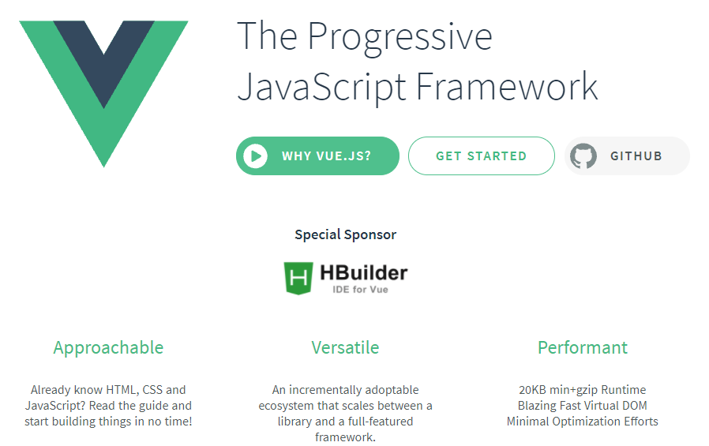

## 1. Study Agenda
- [Github](https://github.com/LabofDev/Vue.git) Branch Name : **`vue-endofvue-1.init`**
- summary
  - 강좌에서 개발할 웹어플리케이션에 대해서 확인하고 일반적인 웹개발 절차와 API 문서에 대해서 알아본다.
### 1.1 Introduce Application
  - `회원가입`, `로그인`, `CRUD`가 발생하는 기본적인 웹어플리케이션
### 1.2 Procedure of Front-End Development
- 웹 개발 절차
  - 요구사항 > 서비스 기획 > UI, UX 상세 설계 > GUI 디자인 > 퍼블리싱 > Back-End API 개발 > Front-End 개발 > QA
- Front-End 개발자의 역할
  - Client UI에 대한 코드 작성
  - 기획, 디자인, 퍼블리싱, Back-End 개발자와 소통
### 1.3 Document of API
- [Swagger UI](https://swagger.io/)
  - [Swagger](https://ko.wikipedia.org/wiki/%EC%8A%A4%EC%9B%A8%EA%B1%B0_(%EC%86%8C%ED%94%84%ED%8A%B8%EC%9B%A8%EC%96%B4))는 개발자가 RESTfull API를 설계, 빌드, 문서화, 소비하는 일을 도와주는 오픈소스 소프트웨어 프레임워크

## 2. Configuration of Development Environment
- [Github](https://github.com/LabofDev/Vue.git) Branch Name : **`vue-endofvue-2.environment`**
- summary

## 3. Router & Design of Component
- [Github](https://github.com/LabofDev/Vue.git) Branch Name : **`vue-endofvue-3.router_component`**
- summary
## 4. Development of Member Register
- [Github](https://github.com/LabofDev/Vue.git) Branch Name : **`vue-endofvue-41.dev_member`**
- summary
## 5. Configuration of Project
- [Github](https://github.com/LabofDev/Vue.git) Branch Name : **`vue-endofvue-5.configure`**
- summary
## 6. Development of Login
- [Github](https://github.com/LabofDev/Vue.git) Branch Name : **`vue-endofvue-6.dev_login`**
- summary
## 7. Store & Login State Management
- [Github](https://github.com/LabofDev/Vue.git) Branch Name : **`vue-endofvue-7.store_state`**
- summary
## 8. API Authentication by Token
- [Github](https://github.com/LabofDev/Vue.git) Branch Name : **`vue-endofvue-8.api_auth_token`**
- summary
## 9. Development of Retrieve Note Data
- [Github](https://github.com/LabofDev/Vue.git) Branch Name : **`vue-endofvue-9.dev_retrieve`**
- summary
## 10. Management of Authentication Value using Browser Storage
- [Github](https://github.com/LabofDev/Vue.git) Branch Name : **`vue-endofvue-10.mgmt_auth_browser_storage`**
- summary
## 11. Development of Create Note Data
- [Github](https://github.com/LabofDev/Vue.git) Branch Name : **`vue-endofvue-11.dev_create`**
- summary
## 12. Middle Adjustment
- [Github](https://github.com/LabofDev/Vue.git) Branch Name : **`vue-endofvue-12.middle_adj`**
- summary
## 13. API Function Modularity
- [Github](https://github.com/LabofDev/Vue.git) Branch Name : **`vue-endofvue-13.api_modularity`**
- summary
## 14. Development of Delete Note Data
- [Github](https://github.com/LabofDev/Vue.git) Branch Name : **`vue-endofvue-14.dev_delete`**
- summary
## 15. Development of Modify Note Data
- [Github](https://github.com/LabofDev/Vue.git) Branch Name : **`vue-endofvue-15.dev_modify`**
- summary
## 16. Data Formatting
- [Github](https://github.com/LabofDev/Vue.git) Branch Name : **`vue-endofvue-16.data_format`**
- summary
## 17. Router Advanced
- [Github](https://github.com/LabofDev/Vue.git) Branch Name : **`vue-endofvue-17.router_adv`**
- summary
## 18. Introduce of Front-End Testing
- [Github](https://github.com/LabofDev/Vue.git) Branch Name : **`vue-endofvue-18.front_end_test`**
- summary
## 19. End of
- [Github](https://github.com/LabofDev/Vue.git) Branch Name : **`vue-endofvue-19.end`**
- summary
